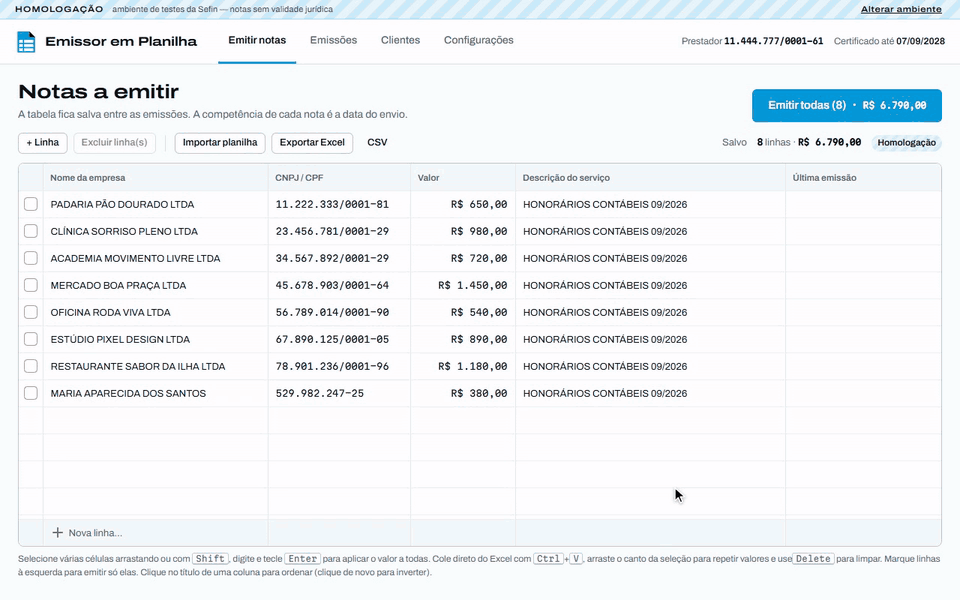
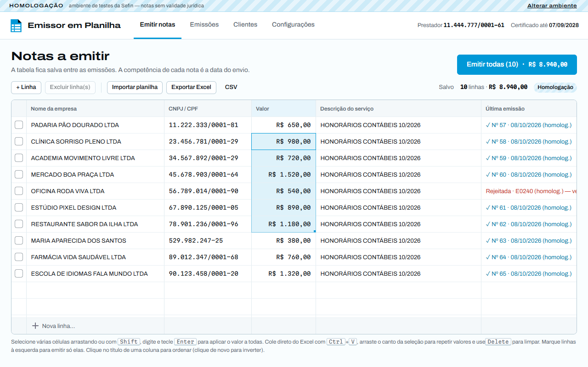
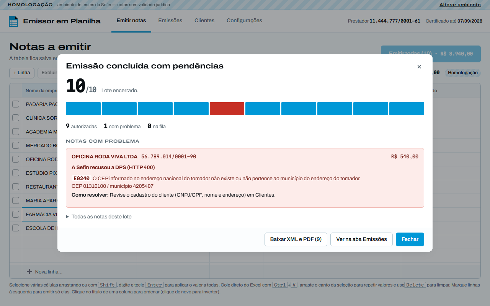
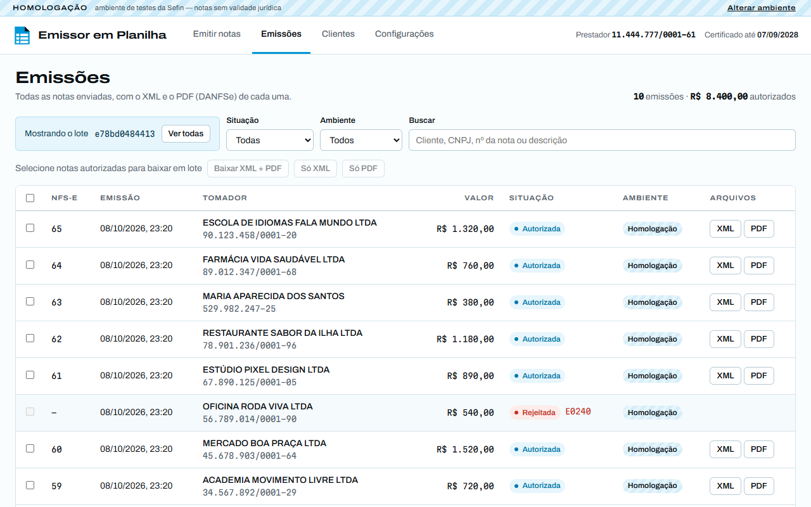
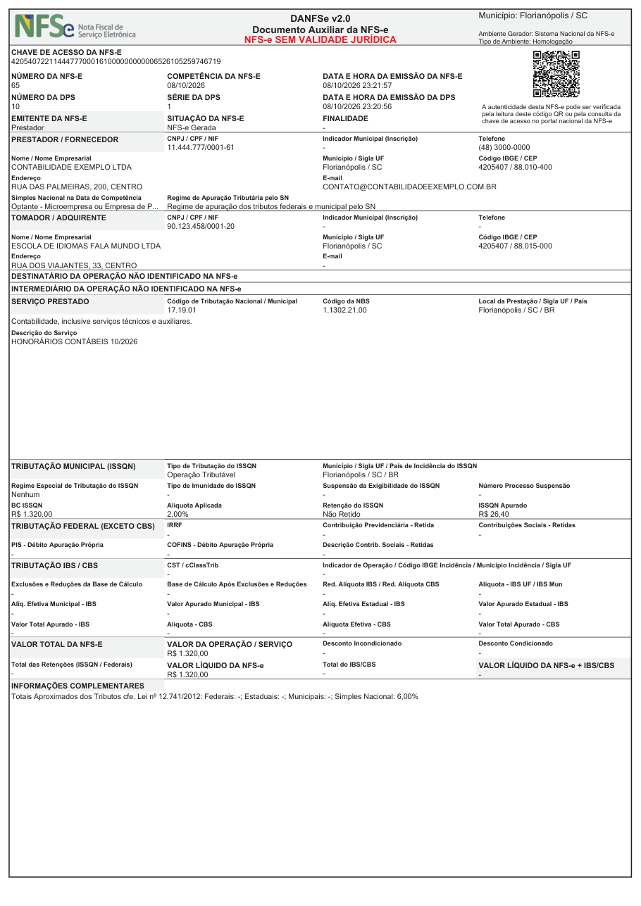
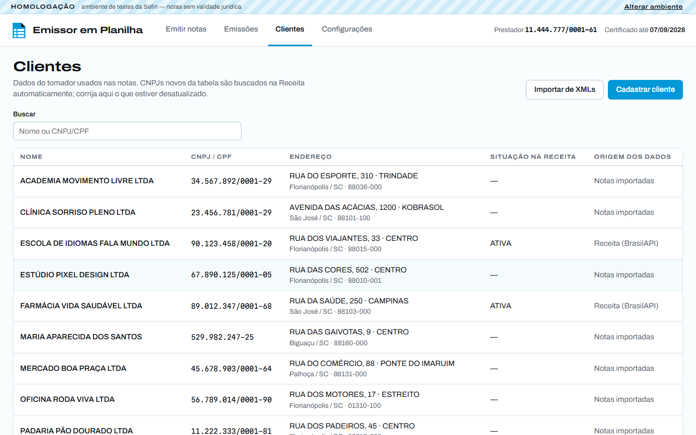
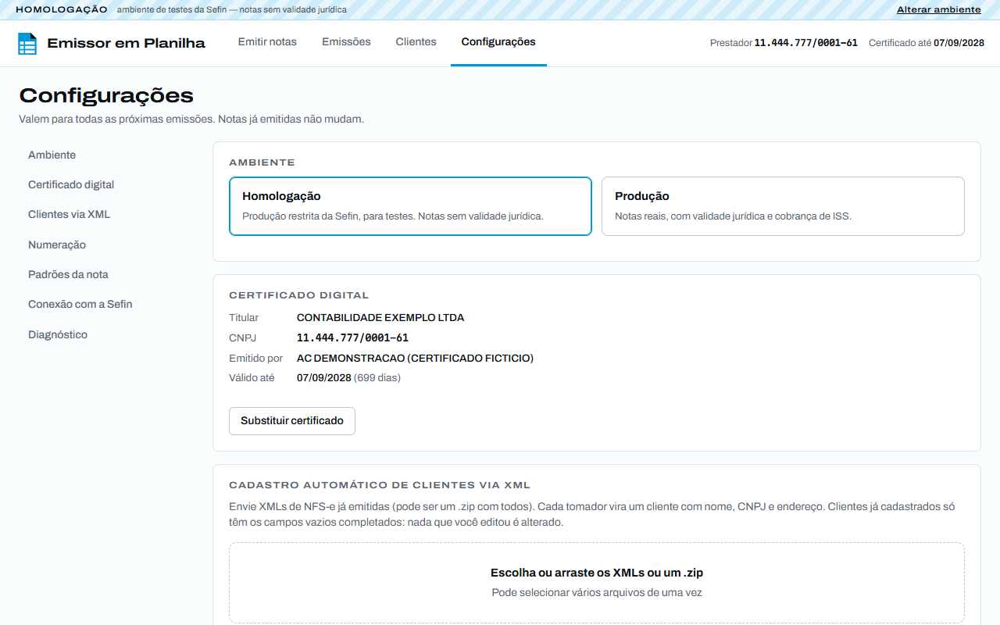
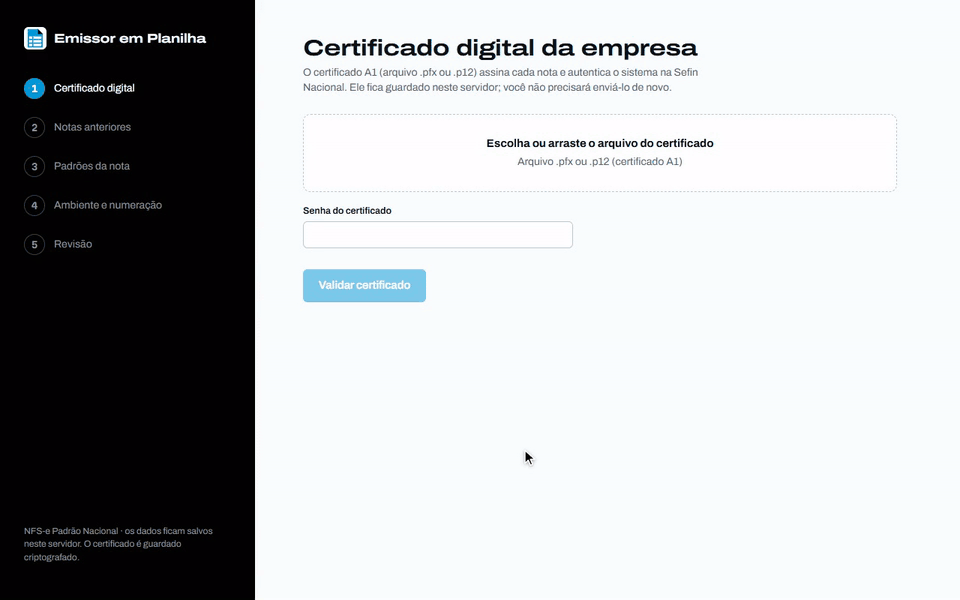

<p align="center">
  
</p>

<h1 align="center">Emissor em Planilha</h1>

<p align="center">
  Emita dezenas de <strong>NFS-e do Padrão Nacional</strong> de uma vez, a partir de uma tabela que funciona como o Excel.<br>
  Assinatura com o certificado A1, envio para a Sefin Nacional, XML e DANFSe em PDF. Tudo no navegador.
</p>

<p align="center">
  <a href="#instalação">Instalação</a> ·
  <a href="#primeiros-passos">Primeiros passos</a> ·
  <a href="#uso-no-dia-a-dia">Uso no dia a dia</a> ·
  <a href="#perguntas-frequentes">Perguntas frequentes</a> ·
  <a href="#desenvolvimento">Desenvolvimento</a>
</p>

<p align="center">
  
</p>
<p align="center">
  <sub>Demonstração com dados fictícios e Sefin simulada (40 s). <a href="docs/video/emissao.mp4">Ver em MP4</a>.</sub>
</p>

---

## Para quem é

Para quem emite **muitas notas de serviço todo mês para os mesmos clientes**: escritórios de contabilidade,
consultorias, prestadores com carteira fixa. Em vez de preencher nota por nota no Emissor Web nacional, você mantém
uma tabela com **cliente, CNPJ/CPF, valor e descrição**, ajusta o que mudou no mês e emite tudo de uma vez.

O sistema roda em **um computador da rede local** (ou em Docker) e é usado pelo navegador de qualquer máquina do
escritório. Não depende de serviço pago nem de nuvem: conversa direto com a Sefin Nacional usando o certificado da
empresa.

## Funcionalidades

- **Tabela tipo Excel**: seleção em faixa, digitar e aplicar a várias células de uma vez, copiar/colar do Excel,
  alça de preenchimento, ordenação por coluna. A tabela fica salva de um mês para o outro.
- **Importar e exportar** a tabela em Excel (`.xlsx`) ou CSV.
- **Emissão em lote** com progresso em tempo real. A fila envia uma nota por vez e, se a conexão cair, consulta a
  Sefin antes de reenviar: a mesma DPS nunca vira duas notas.
- **Erros explicados**: código e mensagem da Sefin, a linha (cliente) afetada e como corrigir. Uma rejeição não
  para o lote; falha de certificado ou Sefin fora do ar para, e as notas restantes ficam para depois.
- **Conferência antes de emitir**: quantidade, valor total, ambiente e avisos (cliente sem endereço, CNPJ inativo na
  Receita, nota igual já emitida no mês).
- **Homologação e produção**: comece em Produção Restrita (notas de teste) e mude para Produção nas configurações.
  O ambiente fica sempre visível no topo, e emitir em produção exige digitar EMITIR.
- **Emissões**: busca e filtros, XML e PDF de cada nota, ou várias de uma vez em um ZIP.
- **Cancelamento** de uma ou várias notas (evento 101101), com motivo. O PDF passa a sair com a marca d'água
  CANCELADA, e em produção é preciso digitar CANCELAR para confirmar.
- **Situação sempre atualizada**: ao abrir a aba Emissões, o sistema confere no Ambiente Nacional (ADN) se alguma
  nota foi cancelada ou substituída fora dele (no portal nacional ou pela prefeitura) e atualiza a lista.
- **DANFSe gerado no próprio servidor**, conforme a **NT 008/2026 v1.02** (a geração oficial por API foi suspensa em
  03/08/2026), com QR Code para a consulta pública.
- **Cadastro automático de clientes** a partir de XMLs de notas antigas e da [BrasilAPI](https://brasilapi.com.br)
  para CNPJs novos. A emissão nunca depende da API externa: se ela falhar, você completa o endereço à mão.
- **Configuração inicial guiada**: envie o certificado e alguns XMLs de notas já emitidas; os padrões da nota
  (código do serviço, regime tributário, tributos) e a tabela de clientes saem deles.
- **Certificado A1 criptografado** no servidor, com aviso 30 dias antes de vencer.
- **Arquivo de diagnóstico** com todas as trocas com a Sefin (sem senhas nem chave privada) para resolver problemas.

## Capturas de tela

| Tabela de notas a emitir | Lote com uma nota rejeitada |
|---|---|
|  |  |
| **Emissões** | **DANFSe (NT 008/2026)** |
|  |  |
| **Clientes** | **Configurações** |
|  |  |

<sub>Todas as imagens usam dados fictícios, um certificado falso e uma Sefin simulada.</sub>

## Instalação

Escolha **uma** das duas formas. As duas sobem o sistema em `http://<nome-ou-IP-do-computador>:8000`.

### Opção 1 — Windows, com `iniciar.bat`

Precisa de:

- [uv](https://docs.astral.sh/uv/getting-started/installation/) (instala o Python sozinho). No PowerShell:
  `powershell -ExecutionPolicy ByPass -c "irm https://astral.sh/uv/install.ps1 | iex"`
- [Node.js](https://nodejs.org/) LTS (só para gerar a página). Ou: `winget install OpenJS.NodeJS.LTS`

Depois:

1. Baixe o projeto (botão **Code → Download ZIP** ou `git clone`) no computador que vai servir o sistema.
2. Dê dois cliques em **`iniciar.bat`** e deixe a janela aberta. Na primeira vez ele instala as dependências e gera
   a página (cerca de 1 minuto); nas outras, só inicia.
3. Se o Windows perguntar, **permita o acesso em redes privadas** no firewall.
4. Abra `http://localhost:8000` neste computador, ou `http://<nome-do-computador>:8000` nos outros. A janela mostra
   os dois endereços.

Para **atualizar**, baixe a versão nova (ou `git pull`) e rode o `iniciar.bat` de novo: ele percebe que o código
mudou e refaz o que for preciso. Para iniciar junto com o Windows, coloque um atalho do `iniciar.bat` na pasta que
abre com <kbd>Win</kbd>+<kbd>R</kbd> → `shell:startup`.

### Opção 2 — Docker (Windows, Linux ou macOS)

Com [Docker](https://docs.docker.com/get-started/get-docker/) instalado, na pasta do projeto:

```bash
docker compose up -d
```

- Os dados ficam na pasta `./data` (é ela que vai no backup).
- Para atualizar: `git pull` e `docker compose up -d` de novo (a imagem é refeita sozinha).
- Log: `docker compose logs -f` · Parar: `docker compose down`.
- O DANFSe usa Liberation Sans, de mesmas medidas da Arial exigida pela NT 008. No Windows dá para usar as fontes
  originais: veja as linhas comentadas em [`docker-compose.yaml`](docker-compose.yaml).

## Primeiros passos

<p align="center">
  
</p>
<p align="center"><sub>Configuração inicial (28 s). <a href="docs/video/onboarding.mp4">Ver em MP4</a>.</sub></p>

Na primeira abertura, um passo a passo pede:

1. **Certificado digital A1** da empresa (arquivo `.pfx` ou `.p12`) e a senha.
2. **XMLs de notas já emitidas** (opcional, mas recomendado). Baixe alguns no
   [portal nacional](https://www.nfse.gov.br/EmissorNacional): deles saem os padrões da nota e o cadastro dos
   clientes, e a tabela de emissão já vem montada com o último valor e descrição de cada um.
3. **Padrões da nota**: código de tributação nacional, NBS, regime do Simples, tributação do ISS. Confira com o seu
   contador.
4. **Ambiente e numeração**: comece em **Homologação**, série `1`, próxima DPS `1`.

Antes de emitir notas de verdade:

1. Em **Configurações → Conexão com a Sefin**, clique em **Testar conexão**. Deve dizer que a conexão e o
   certificado foram aceitos.
2. Emita uma ou duas linhas em homologação e confira o PDF e o XML na aba **Emissões**.
3. Só então mude para **Produção** em Configurações (a numeração de produção é separada da de homologação).

## Uso no dia a dia

1. **Ajuste a tabela** do mês: valores que mudaram, descrição nova, clientes que entraram ou saíram.
2. Clique em **Emitir todas** (ou marque algumas linhas à esquerda para emitir só elas), confira o total e confirme.
3. Acompanhe o lote. Se alguma nota for rejeitada, corrija o que a mensagem indicar e emita só aquela linha de novo.
4. Baixe os PDFs e XMLs no fim do lote ou depois, na aba **Emissões**.
5. Precisa cancelar? Abra a nota na aba **Emissões** e clique em **Cancelar NFS-e** (ou marque várias e use
   **Cancelar**). Depois emita a nota correta pela tabela.

Atalhos da tabela:

| Para | Faça |
|---|---|
| Mudar várias células para o mesmo valor | Selecione a faixa (arrastando ou com <kbd>Shift</kbd>), digite e tecle <kbd>Enter</kbd> |
| Trazer linhas do Excel | Copie no Excel e cole na tabela com <kbd>Ctrl</kbd>+<kbd>V</kbd>; colar além da última linha cria linhas novas |
| Repetir um valor para baixo | Arraste o canto da seleção (alça de preenchimento) |
| Limpar células | <kbd>Delete</kbd> |
| Ordenar | Clique no título da coluna (de novo para inverter) |
| Substituir a tabela inteira | **Importar planilha** (`.xlsx` ou `.csv`), substituindo ou acrescentando linhas |

A data de competência é sempre a data da emissão. Clientes novos são consultados na Receita (via BrasilAPI) assim
que o CNPJ entra na tabela; o nome que você digitou prevalece sobre o da Receita.

## Configuração

Variáveis de ambiente (no `iniciar.bat`, descomente as linhas `set`; no Docker, edite `docker-compose.yaml`):

| Variável | Padrão | Para quê |
|---|---|---|
| `EMISSOR_PORT` | `8000` | Porta |
| `EMISSOR_HOST` | `0.0.0.0` | Endereço em que o servidor escuta |
| `EMISSOR_IPS_PERMITIDOS` | _(vazio = todos)_ | Faixas de IP que podem acessar, separadas por vírgula, ex.: `192.168.0.0/24` |
| `EMISSOR_DATA_DIR` | `./data` | Banco, certificado criptografado, XML/PDF emitidos e logs |
| `EMISSOR_FONT_DIR` | | Pasta extra com Arial/Microsoft Sans Serif para o DANFSe |

## Segurança

> [!WARNING]
> O sistema **não tem login**: qualquer computador que abrir a página pode emitir notas com o certificado da
> empresa. Use em uma rede local confiável, restrinja com `EMISSOR_IPS_PERMITIDOS` (ou pelo firewall) e **nunca
> exponha à internet**.

- O certificado e a senha ficam criptografados em `data/`, com a chave em `data/secret.key`. O arquivo `.pfx` nunca
  é devolvido pela página.
- **Faça backup da pasta `data/`** (banco, XMLs e PDFs emitidos, certificado) e não a compartilhe.
- Senha, chave privada e certificado nunca vão para os logs. O arquivo de diagnóstico tem os dados das notas
  (clientes e valores): envie só para quem pode vê-los.

## Perguntas frequentes

**Preciso pagar alguma coisa ou ter conta em algum serviço?**
Não. O sistema fala direto com a Sefin Nacional usando o certificado da empresa. A consulta de CNPJ usa a
BrasilAPI, gratuita.

**Qual série devo usar?**
Qualquer uma de `1` a `49999` (faixa de aplicativos próprios). As séries `70000` a `79999` das notas do Emissor Web
são exclusivas dele e seriam rejeitadas (E0010).

**Uma nota foi rejeitada. E agora?**
A mensagem mostra o código da Sefin e o que corrigir (ex.: CEP que não pertence ao município → corrija o cadastro
do cliente em **Clientes**). Depois marque a linha e emita só ela. As outras notas do lote não são afetadas.

**A internet caiu no meio do lote.**
O lote para, e as notas que não chegaram a ser enviadas ficam como "não enviada": é só emiti-las de novo. Para a nota
que estava sendo enviada na hora da queda, abra-a na aba **Emissões** e clique em **Verificar na Sefin**: o sistema
pergunta à Sefin se ela virou nota antes de qualquer reenvio, para não gerar nota em duplicidade.

**Posso cancelar uma nota pelo sistema?**
Sim: na aba **Emissões**, abra a nota e clique em **Cancelar NFS-e**, escolha o motivo e descreva-o (mínimo de 15
caracteres). Dá para cancelar várias de uma vez marcando-as na lista. O município define até quando e até que valor
a nota pode ser cancelada direto; fora disso a Sefin recusa (ex.: `E0822`, fora do prazo) e a mensagem explica como
pedir a análise fiscal no [portal nacional](https://www.nfse.gov.br/EmissorNacional). O cancelamento não pode ser
desfeito.

**Cancelei uma nota no portal nacional. O sistema fica sabendo?**
Sim. A aba **Emissões** confere a situação no Ambiente Nacional ao ser aberta (no máximo uma vez por hora; use
**Atualizar agora** para conferir na hora, ou **Atualizar situação** dentro de uma nota). Notas canceladas ou
substituídas fora do sistema mudam de situação, e o evento fica no histórico da nota com o XML.

**Algo deu errado e não entendi a mensagem.**
Em **Configurações → Diagnóstico**, baixe o arquivo de diagnóstico e abra uma
[issue](../../issues) descrevendo o que aconteceu (sem anexar dados de clientes em público).

## Como funciona

```
Tabela (cliente, CNPJ/CPF, valor, descrição)
   └─► DPS 1.01 ─► validação nos XSD oficiais ─► assinatura XMLDSig (RSA-SHA256)
          └─► Sefin Nacional (REST + mTLS com o certificado A1)
                 └─► NFS-e autorizada ─► XML salvo + DANFSe em PDF (NT 008/2026)

Cancelamento: pedido de evento 101101 assinado ─► Sefin Nacional ─► evento salvo, PDF com marca CANCELADA
Situação:     Ambiente Nacional (ADN, distribuição por NSU) ─► eventos feitos fora do sistema
```

- **Backend:** Python 3.12, FastAPI, SQLite (SQLModel), lxml, signxml, cryptography, httpx, ReportLab.
- **Frontend:** React 18, TypeScript, Vite, TanStack Query, [Glide Data Grid](https://github.com/glideapps/glide-data-grid).
- Um único processo serve a página e a API (`/api`, documentação em `/docs`).

## Desenvolvimento

```bash
# backend (API em http://127.0.0.1:8000)
cd backend
uv run emissor
uv run pytest -q
uv run ruff check src tests && uv run ruff format src tests

# frontend (Vite em http://localhost:5173, com proxy de /api para :8000)
cd frontend
npm install
npm run dev
npx tsc --noEmit -p tsconfig.json
```

Os testes usam um certificado ICP-Brasil **falso** gerado na hora e uma NFS-e de exemplo com dados fictícios
(`backend/tests/fixtures/`). Para testar com notas reais, coloque os XMLs em `temp/` (fora do git): os testes extras
rodam sozinhos.

Diagnóstico de certificado e conexão mTLS, sem emitir nada:

```bash
cd backend
uv run python -m emissor.nfse.diagnostico --pfx caminho/do/certificado.pfx   # --producao para o ambiente real
```

Decisões de arquitetura, detalhes do leiaute e armadilhas encontradas estão em [`CLAUDE.md`](CLAUDE.md).

```
backend/src/emissor/
  nfse/          núcleo fiscal: DPS, XSD, assinatura, cliente Sefin, erros, leitura de XML
  nfse/danfse/   gerador do DANFSe (NT 008)
  services/      emissão em lote, clientes, tabela, certificado, arquivos
  api/           rotas FastAPI
frontend/src/    páginas React (Onboarding, Emitir, Emissões, Clientes, Configurações)
docs/            NT 008/2026 (DANFSe), imagens e vídeos do README
```

## Limitações conhecidas

- **Substituição** de NFS-e e **solicitação de análise fiscal** para cancelamento fora do prazo: faça pelo portal
  nacional (o sistema reconhece a nota substituída/cancelada depois).
- **Grupo IBS/CBS** (reforma tributária) ainda não é enviado. Para optantes do Simples Nacional ele passa a ser
  obrigatório em **janeiro de 2027**.
- **CNPJ alfanumérico** de tomador é aceito no cadastro, mas a emissão fica bloqueada até a Sefin publicar um XSD
  compatível.
- Sem login (ver [Segurança](#segurança)).

## Aviso

Projeto independente, **sem vínculo** com a Receita Federal, o Comitê Gestor da NFS-e ou a Sefin Nacional. Notas
emitidas em Produção têm validade jurídica: teste em homologação e confira os padrões fiscais com o seu contador
antes de usar.

Feito com [Claude Code](https://claude.com/claude-code), com supervisão humana.

<!-- LICENÇA: escolher (ex.: MIT) e adicionar o arquivo LICENSE na raiz. -->
